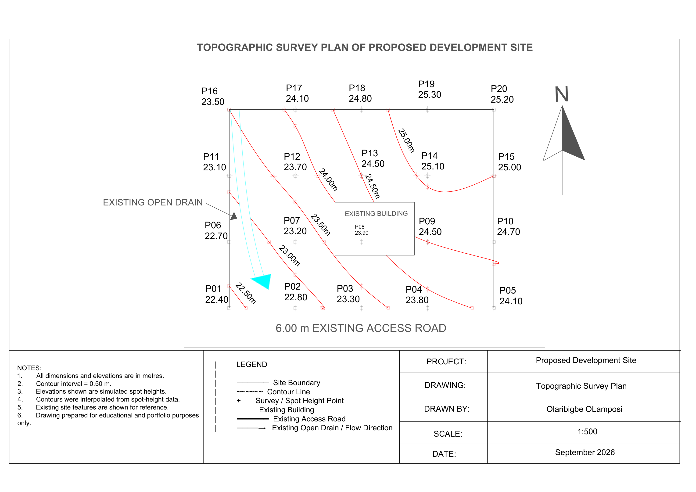

# Topographic Survey Plan — AutoCAD

## Project Overview

This project presents a simulated topographic survey plan created in AutoCAD using spot-height data and manual contour interpolation.

The project was developed to demonstrate how elevation observations can be converted into a topographic drawing containing contour lines, survey points, existing site features, drainage information, and a professional A3 plotting layout.

The final drawing was prepared at a scale of 1:500.

---

## Final Drawing

---

## Project Details

- **Software:** AutoCAD
- **Drawing Type:** Topographic Survey Plan
- **Scale:** 1:500
- **Sheet Size:** A3 Landscape
- **Site Dimensions:** 40 m × 30 m
- **Contour Interval:** 0.50 m
- **Lowest Spot Height:** 22.40 m
- **Highest Spot Height:** 25.30 m
- **Existing Access Road Width:** 6.00 m

---

## Survey Data

The site contains 20 simulated survey points with Easting, Northing, and elevation information.

The elevation data ranges from approximately **22.40 m to 25.30 m**.

The terrain generally rises from the south-western part of the site toward the north-east.

---

## Contour Levels

The following contour levels were interpolated:

- 22.50 m
- 23.00 m
- 23.50 m
- 24.00 m
- 24.50 m
- 25.00 m

Contour interval:

**0.50 m**

---

## Workflow

1. Created a new AutoCAD drawing and configured drawing units.
2. Created layers for survey points, contours, boundary, building, road, drainage, dimensions, and annotations.
3. Plotted 20 survey points using Easting and Northing coordinates.
4. Added spot-height elevations to each survey point.
5. Interpolated contour crossings between survey points.
6. Created contour lines at 0.50 m intervals.
7. Smoothed and labelled the contour lines.
8. Added an existing building footprint.
9. Added a 6.00 m existing access road.
10. Added an existing open drain and flow direction.
11. Added the north arrow, title, notes, and legend.
12. Prepared an A3 Paper Space layout.
13. Set the drawing scale to 1:500.
14. Prepared the final sheet for PDF plotting and portfolio presentation.

---

## AutoCAD Features Used

- Coordinate input
- POINT
- LINE
- POLYLINE
- SPLINE
- RECTANGLE
- OFFSET
- TRIM
- Object Snap
- Layers
- MTEXT
- Dimensions
- Paper Space
- Viewports
- Plotting
- Lineweights

---

## Skills Demonstrated

- AutoCAD 2D drafting
- Topographic survey drafting
- Spot-height interpretation
- Contour interpolation
- Terrain representation
- Coordinate plotting
- Layer management
- Drainage representation
- Site-plan drafting
- Technical annotation
- Paper Space layout
- Viewport scaling
- Technical drawing presentation

---

## Site Features

The drawing includes:

- Survey / spot-height points
- Site boundary
- Contour lines
- Existing building
- Existing access road
- Existing open drain
- Drainage flow direction
- North arrow
- Notes
- Legend
- Technical title block

---

## Project Files

- `Topographic_Survey_Plan.dwg` — editable AutoCAD drawing
- `Topographic_Survey_Plan_Final.pdf` — final A3 drawing
- `Topographic_Survey_Plan_Preview.png` — portfolio preview image

---

## Key Learning Outcomes

This project improved my understanding of how spot-height survey data can be converted into contour information and presented as a professional topographic survey drawing.

I also developed practical experience with contour interpolation, terrain interpretation, site-feature drafting, layer management, Paper Space layouts, viewport scaling, and technical drawing presentation.

---

## Disclaimer

This project was created for educational and portfolio purposes using simulated survey data.

It is not a legally certified topographic survey and should not be used for construction, land registration, engineering design, or any official surveying purpose.

---

## Author

**Olaribigbe Olamiposi**

Surveying & Geo-Informatics  
AutoCAD | GIS | Geospatial Analysis
